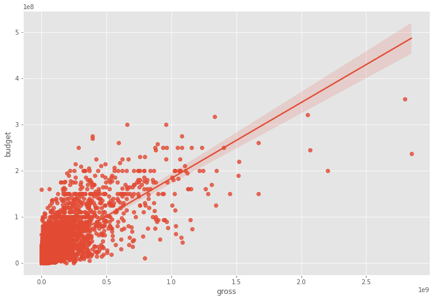
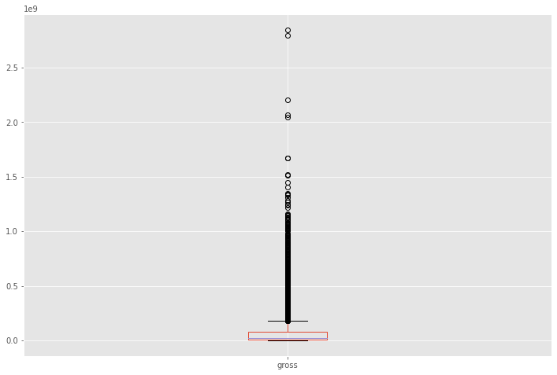
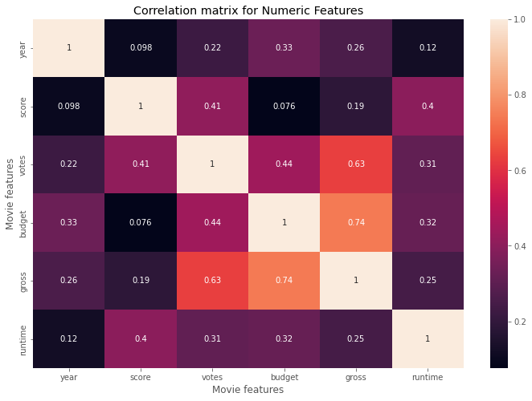
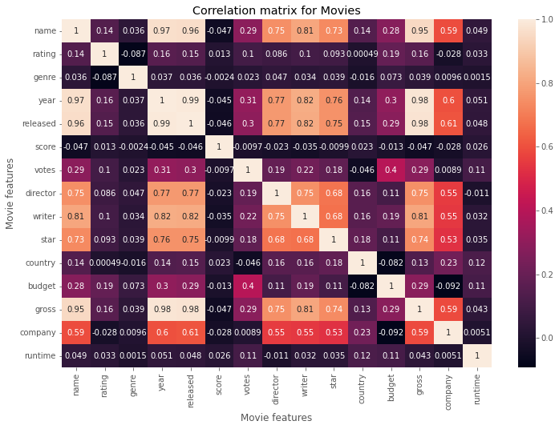

# Análisis de correlación de películas

Este informe presenta un análisis de correlación de diferentes características de películas, como el presupuesto, la recaudación, la calificación y otros aspectos relevantes.

## Introducción

El objetivo de este análisis es estudiar las relaciones entre diferentes características de las películas y descubrir posibles patrones o tendencias que puedan proporcionar información valiosa para la industria del cine.

## Metodología

Para llevar a cabo este análisis, se han utilizado las siguientes librerías de Python:

pandas: para la manipulación y el análisis de datos.
numpy: para operaciones matemáticas y de álgebra lineal.
seaborn: para la visualización de datos estadísticos.
matplotlib: para la generación de gráficos y visualizaciones.

El proceso de limpieza y preparación de datos incluyó la eliminación de duplicados, el tratamiento de valores faltantes y la conversión de tipos de datos para facilitar el análisis.

## Análisis exploratorio

Se generaron gráficos de dispersión y boxplots para identificar relaciones entre variables y posibles valores atípicos. Estas visualizaciones ayudaron a detectar patrones y a comprender mejor la distribución de los datos.

* 
* 

## Matriz de correlación

Se calcularon las matrices de correlación de Pearson y Kendall para analizar las relaciones lineales y de rango entre las variables numéricas. Posteriormente, se visualizó la matriz de correlación mediante un mapa de calor.

* Visualización de la matriz de correlación mediante un mapa de calor.
* 

## Análisis de correlación con variables categóricas

Para analizar las relaciones entre variables categóricas y numéricas, se convirtieron las variables categóricas a numéricas utilizando la función factorize. Luego, se calculó la matriz de correlación con las variables categóricas convertidas y se visualizó mediante un mapa de calor.

* Visualización de la matriz de correlación con un mapa de calor.
* 

## Resultados

Se identificaron pares de variables con alta correlación, lo que sugiere relaciones significativas entre estas características. Además, se visualizó la relación entre la calificación y la recaudación para entender cómo influye la calificación en el desempeño financiero de una película.

* Visualización de la relación entre la calificación y la recaudación.
* 

## Conclusiones

* A lo largo del análisis, se pudo identificar una correlación positiva entre el presupuesto de una película y su recaudación bruta. Esto sugiere que las películas con presupuestos más altos tienden a generar mayores ingresos en taquilla.
* La matriz de correlación también mostró que existe una relación entre el año de lanzamiento de la película y el nombre de la misma. Es probable que esto se deba a que a medida que pasa el tiempo, se producen más películas y, por lo tanto, se necesitan nombres más variados.
* Al analizar la relación entre la calificación y la recaudación, no se encontró una correlación significativa. Esto indica que una calificación más alta no garantiza necesariamente una mayor recaudación en taquilla.
* Las compañías cinematográficas también influyen en las correlaciones encontradas, mostrando una fuerte relación entre la compañía y otros aspectos como el director, el escritor y la estrella de la película.
* Al analizar las correlaciones con variables categóricas convertidas a numéricas, pudimos observar una matriz de correlación más rica y con más información sobre las relaciones entre las diferentes características de las películas.

## Implicaciones y posibles aplicaciones de los resultados:

* La correlación entre el presupuesto y la recaudación bruta puede ser útil para los inversores y productores de películas que buscan maximizar sus ingresos en taquilla. Sin embargo, es importante tener en cuenta que la correlación no implica causalidad y que hay otros factores en juego que también pueden influir en el éxito financiero de una película.
* La falta de correlación entre la calificación y la recaudación bruta sugiere que los creadores de películas y los especialistas en marketing no deberían centrarse únicamente en obtener calificaciones altas. En cambio, pueden considerar otros aspectos, como la narrativa, el género y el elenco, que podrían atraer a una audiencia más amplia y generar mayores ingresos.
* La influencia de las compañías cinematográficas en las correlaciones encontradas resalta la importancia de establecer relaciones sólidas con estudios y productoras de renombre. Estas relaciones pueden aumentar las posibilidades de éxito en la industria y mejorar la calidad de las películas producidas.
* Los resultados de este análisis pueden utilizarse para informar decisiones en la industria del cine, desde la elección del elenco y la dirección hasta la asignación de presupuestos y la estrategia de marketing. Aunque las correlaciones no garantizan el éxito, proporcionan información valiosa que puede ser útil al tomar decisiones informadas en el competitivo mercado cinematográfico.
